# InformeTarea5

1. OBJETIVOS

☻ Generales:

* Ser capaces de reconocer los Teoremas de Redes a profundidad de los conceptos fundamentales.

* Conocer la Capacitancia e Inductancia junto a sus derivadas a través del análisis a fondo sus definiciones. 

☻Específicos:

2. Marco Teorico 

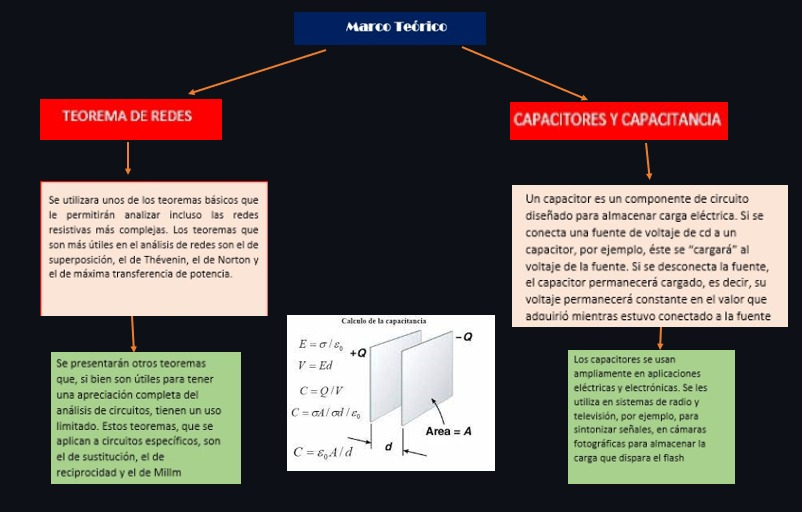

3. EXPLICACIÓN Y RESOLUCIÓN DE EJERCICIOS O PROBLEMAS:

UNIDAD 9

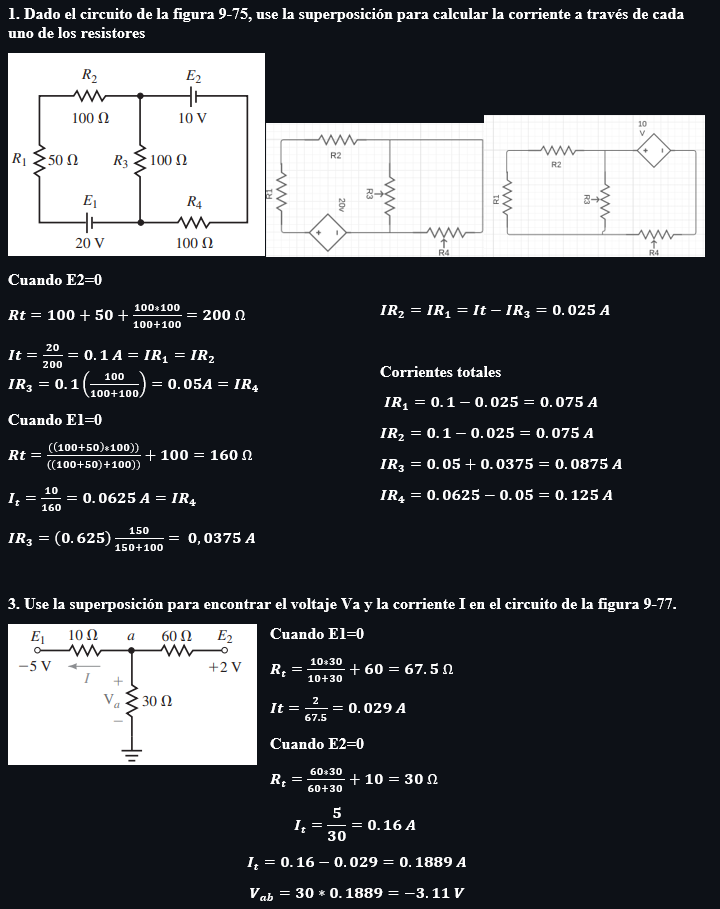

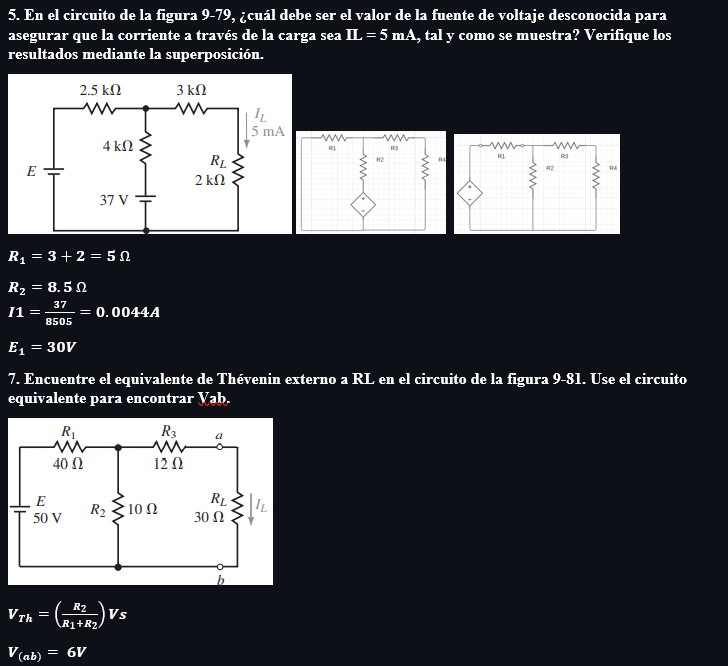

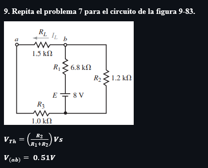

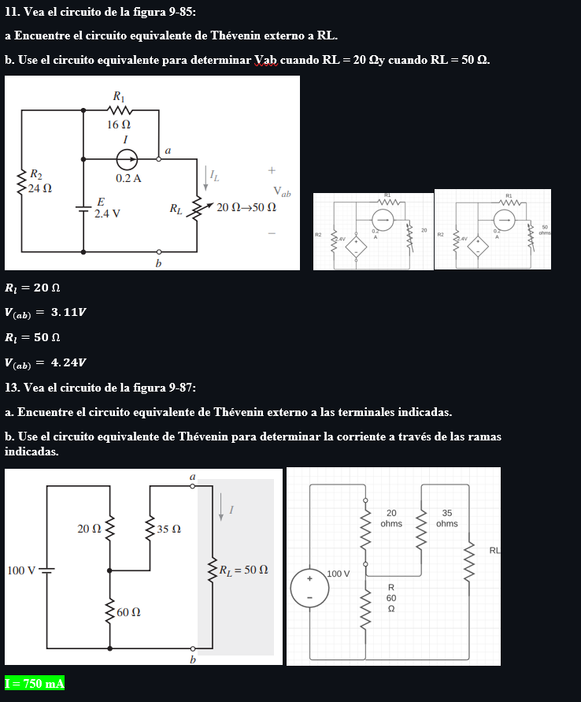

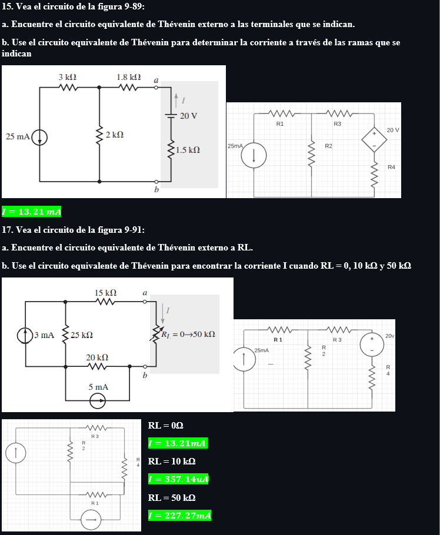

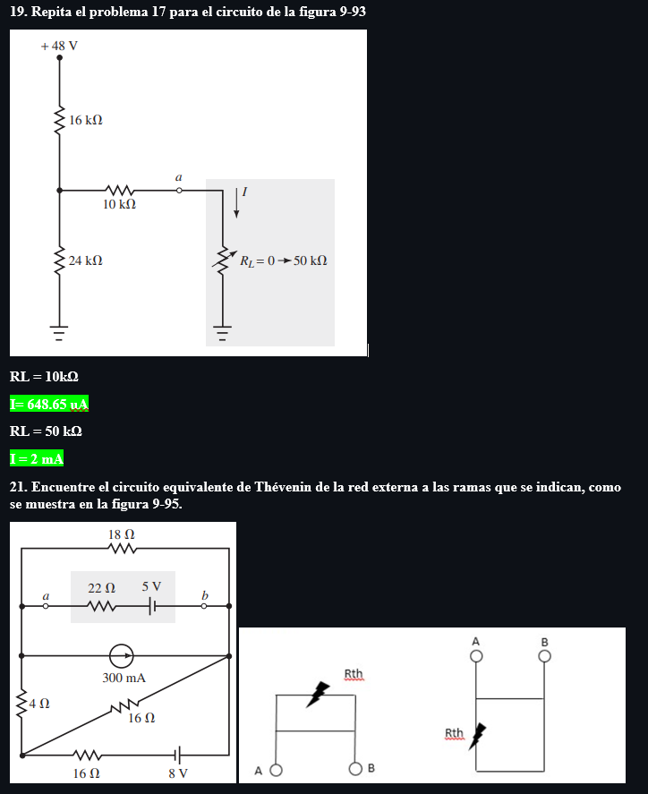

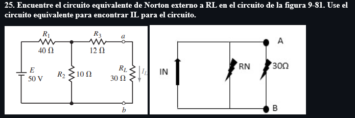

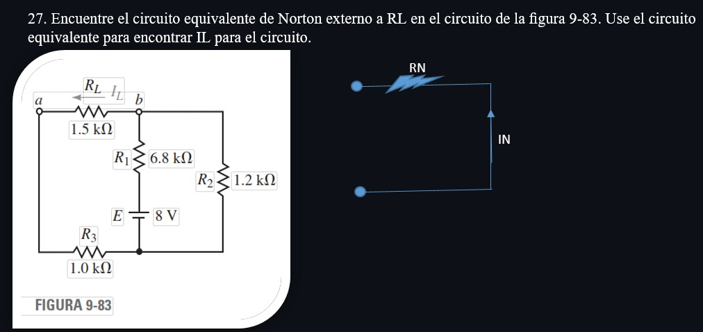

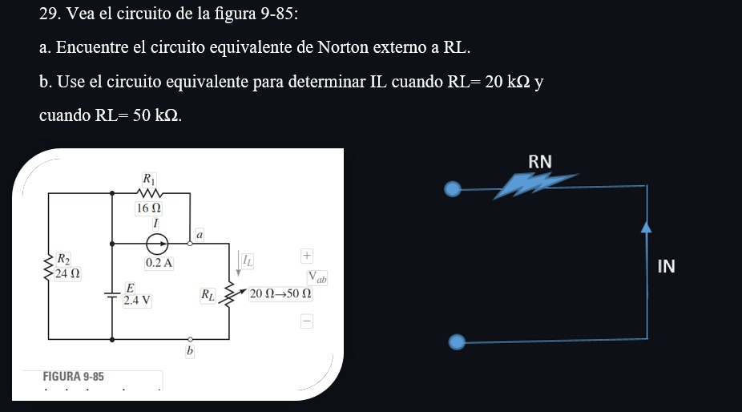

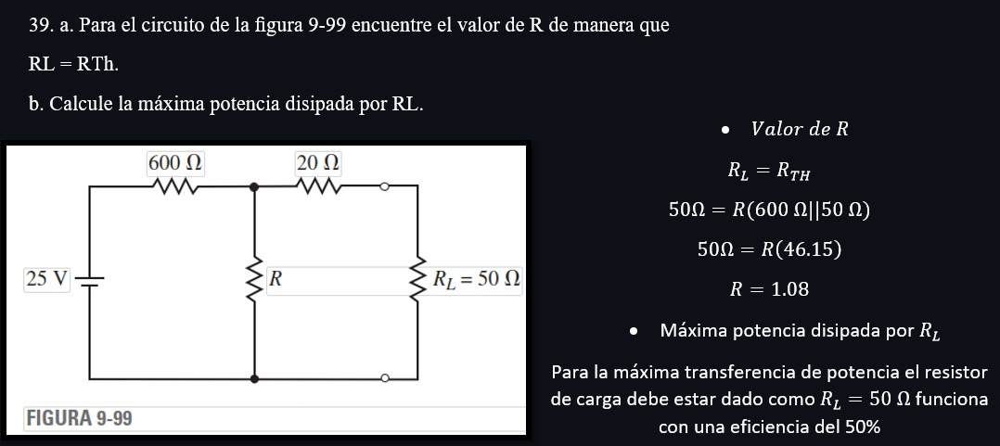

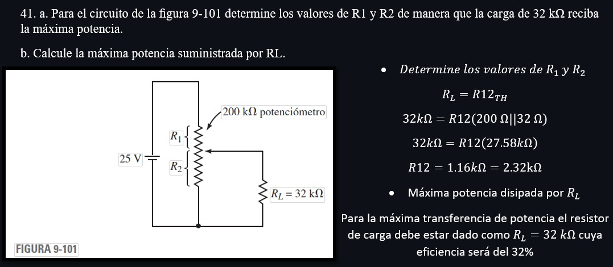

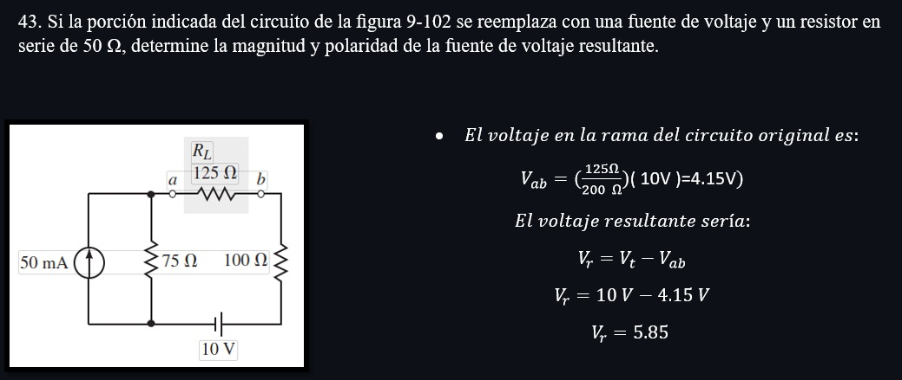

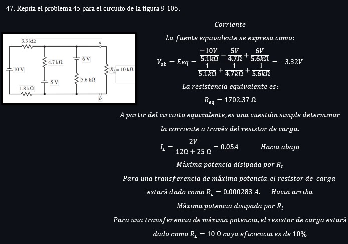

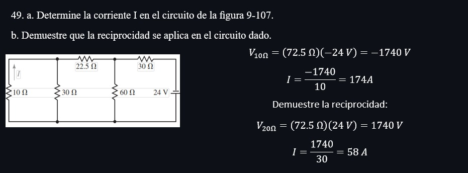

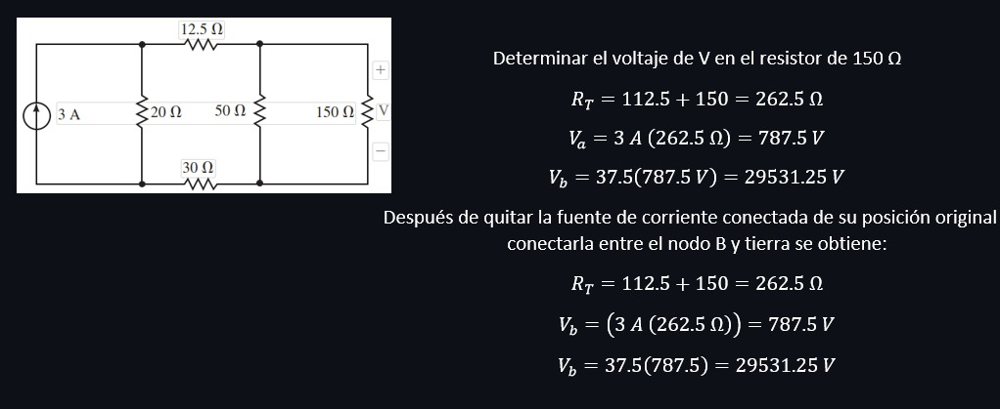

UNIDAD 10

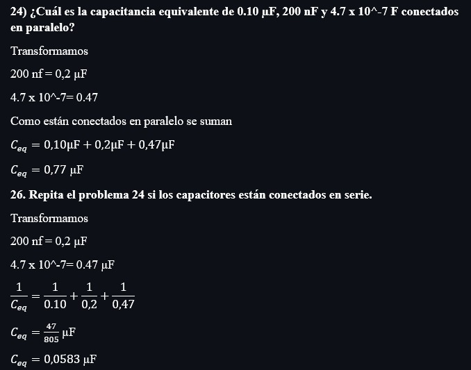

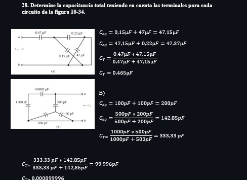

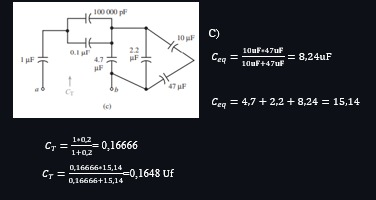

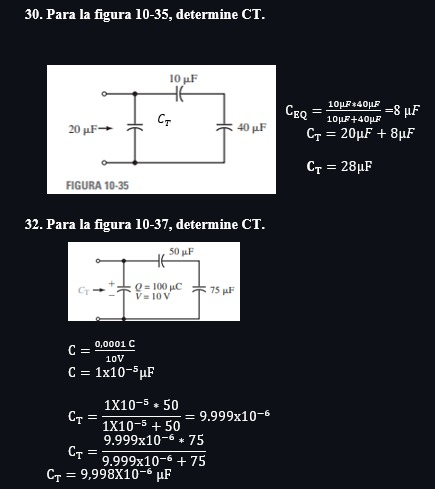

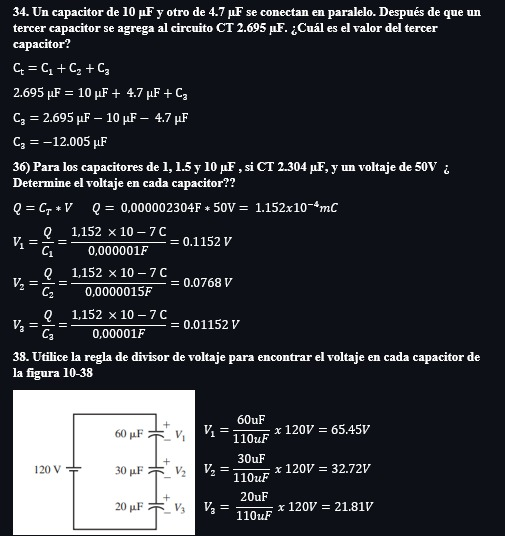

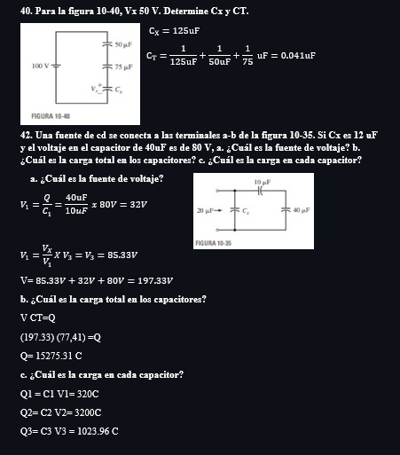

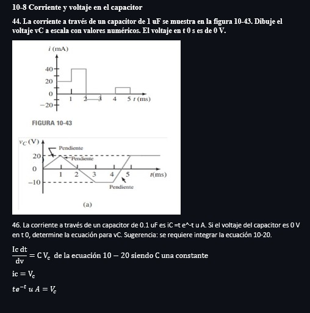

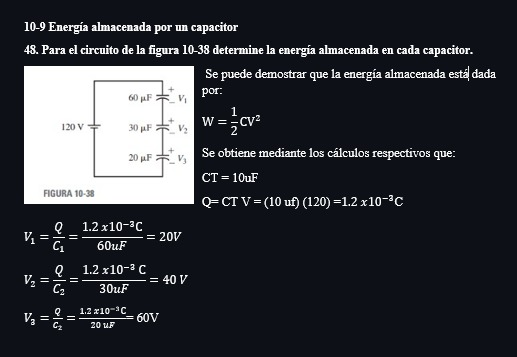

4. VDEO:

https://www.youtube.com/watch?v=ZiCMjfpxjf4

5. CONCLUSIONES:

* Tras el análisis a profundidad de los conceptos de Capacitancia e Inductancia, ahora somos capaces de reconocer las fallas en el capacitor y dar solución a los problemas.

* Se concluyo que con el uso de Teoremas de Redes facilitamos y reducimos el análisis y cálculo de Circuitos.

6. BIBLIOGRAFÍA:

